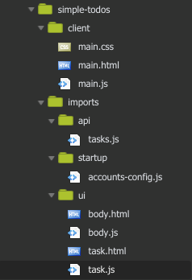
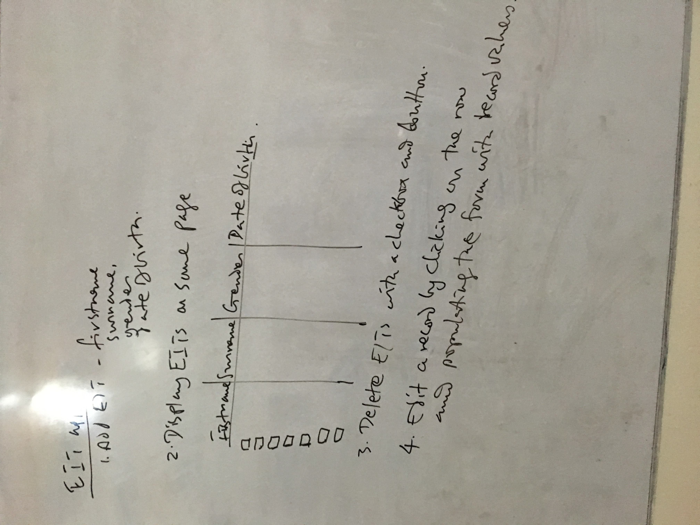

# About
- Build an EIT Management App with Meteor.

- Fields: First name, Lastname, Date of Birth & Gender.

- Deadline: Monday @ 8am; 17 Sept 2018

# EIT Management System(MS)

1. Add EIT - firstName, Surname, gender, dateOfBirth
2. Display EITs on same page

| # | Firstname | Surname | gender  | dob     |
| - | --------- | :------ | :-----: | :----:  |
| 1 |   Todun   | O       |    m    |         |

​           
3. delete EITs with a checkedbox and button
4. Edit a record by clicking on the row and populating the form with record values

# OUTPUT

first name  	[_enter first name_]
surname     	[_enter your last name_]
gender      	[_enter your gender_]
dob         	[_enter date of birth_]

| # | Firstname | Surname | gender  | dob        |
| - | --------- | :------ | :-----: | :----:     |
| 1 |   Todun   | O       |    m    | 09/17/2018 |

# The Task

#### We are building an EIT management application - 

- [x] create an EIT record, 
- [x] update it and 
- [x] delete it. 

#### The details we are collecting are 
- [x] first name, 
- [x] last name, 
- [x] gender and 
- [x] date of birth. 

The records must be displayed in 
- [x] a table and 
- [ ] delete them in bulk by   
    - [ ] *selecting check boxes* and 
    - [ ] clicking a DELETE button
      
Also, 
- [x] remove the insecure package and 
- [x] use meteor methods on the server side to make your application secure. 

Also, 
- [x] support user accounts.

# Application Structure
You may structure your app however you like, but it's highly recommended that you use 
the same structure as the simple-todos app.

# Hosting
You would be hosting this app with meteor-now and mlab. meteor-now is a package 
that hosts your app and gives you a URL, and mlab is a MongoDB Database-as-a-Service 
service. Here are the steps to host your app

1. Update your node to at least 7.10.0. You can check your node version with node -v 
    and update node with nvm install 7.10.0.
2. Create an account on mlab. These are the instructions:

    a. Creating the sandbox.

    b. Click on  "Create New"

    c. Select the sandbox "Free" and continue

    d. Select any aws region and  continue
    
    e. Give your database a name and continue
    
    f. Submit Order

    g. It will redirect you to their home page

    h. Click on the database created and set your username and password for the collection.

    i. Click on the users tab and Click on the "Add database user"

    j. Enter the username and password for the collection.
3. Put your app online. Steps:

    a. `npm install -g now meteor-now`

    b. `now login`

    c. `meteor-now -e MONGO_URL=mongodb://<dbuser>:<dbpassword>@ds155862.mlab.com:55862/deonedb now --public`

    d. You'll get a URL when this is done. My URL for the simple-todos app is `https://simple-todos-fdceqiyndz.now.sh/`

    e. You can get more info on these steps here.

# Question

# References
1. [Markdown syntax](https://github.com/adam-p/markdown-here/wiki/Markdown-Cheatsheet#tables)
2. [Meteor Special directories](https://guide.meteor.com/structure.html#special-directories)
3. [Serving static content in meteor projects](https://stackoverflow.com/a/21341394/773257)
4. [Markdown Code and syntax highlighting](https://github.com/adam-p/markdown-here/wiki/Markdown-Cheatsheet#code) 